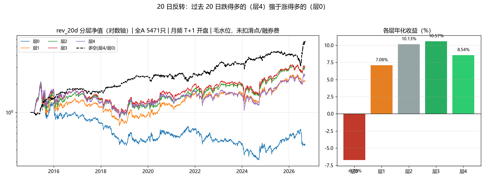
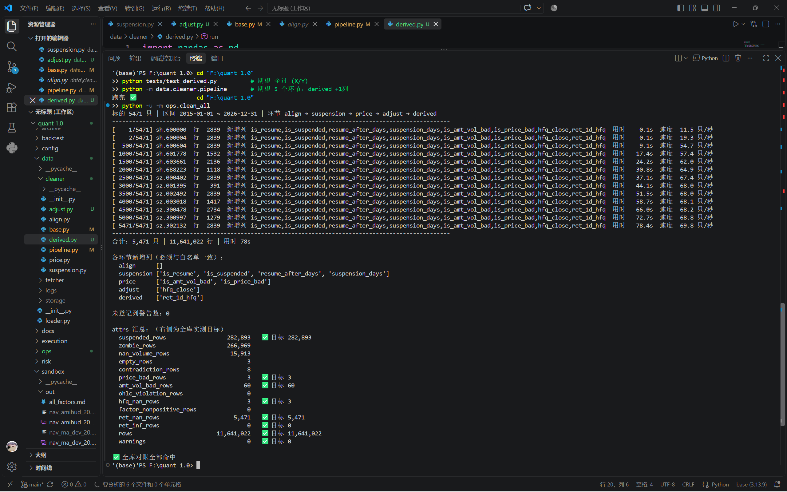

# 一个学生的 A 股数据管道（从零开始，边学边写）

> **EN (TL;DR)** — A from-scratch daily-bar pipeline for the Chinese A-share market
> (5,553 tickers including 337 delisted). The data layer and the cleaning executor work
> end-to-end; the cleaning stages are being written one by one. Wrong turns, bugs and the
> lessons from them are documented in [PITFALLS.md](PITFALLS.md).
>
> 这个仓库兼职我的开发日志 —— 所以你会看到大量"当时不懂、后来踩坑、然后想通"的记录。

**进度**：数据下载 ✅ · 数据层 loader ✅ · 清洗 base ✅ · 执行器 pipeline ✅ · **清洗 5 环节 `align → suspension → price → adjust → derived` ✅** · **净数据全库落盘 ✅** · backtest 面板 / 因子 / 引擎 ⬜ · 因子+回测最小闭环 ✅（`sandbox/` 实验版，毛水位）
**最近更新（2026-09-22）**：清洗管道补完 —— `adjust`（复权，`hfq_close`）与 `derived`（日收益，`ret_1d_hfq`）落地并验收（**23/23**、**19/19**），5 环节全库跑通（**未登记列警告 0**）；清洗产物首次**全库落盘**（5,471 文件 / **652 MB** / 338 秒 / 失败 0）+ `cleaner_meta.json` 总账。复权的价值也第一次被量化：\|日收益\| > 21% 的行数 **raw 5,344 → hfq 328**。

### ★ 2026-09-21　认知重构：从「造一把更准的尺子」到「先拿尺子量一样东西」

> 我以为我在造一把尺子 —— 其实一直在琢磨刻度线怎么刻，**从没拿它量过任何东西**。
> 今天和老师聊完，改的是**整个项目的主次**：
>
> 1. **手艺人 → 工程师**：不再只问"这个数据对不对"，还要问"这个数据在**为谁的判断服务**"；
> 2. **先跑通完整闭环**（数据 → 因子 → 组合 → 撮合 → 净值 → 指标 → 报告），再回头补数据工程的深度；
> 3. **毛水位 ≠ 结论**：漂亮数字先量清它离现实有多远（成本 / 融券费 / 中性化 / 多重检验 / 样本外）
>    —— 粗算下来多空夏普 **1.05 → 净 0.1~0.4**。
>
> 详细记录：**[2026-09-21 日志](#2026-09-21)**　｜　这一次重构产出的东西：下文《第一个最小闭环：20 日反转（最新结果）》

<!-- 新增「思路转折」的日志时：在下面这张表加一行，锚点 = #YYYY-MM-DD（和日志标题一致） -->
**开发日志里其他几次思路转折**（备查，点日期直达）：

| 日期 | 当时改变了什么 |
| :-- | :-- |
| [2026-09-20](#2026-09-20) | 验收方式定型：**先写参照值，再断言**；"数字对上"比"看起来对"可靠 |
| [2026-09-19](#2026-09-19) | **标记正确 ≠ 规划完整**；每一列都要声明"什么时候能拿到" |
| [2026-09-18](#2026-09-18) | 同一个检查换个口径，误报差 **70 倍**；开始"给数据立契约" |
| [2026-09-17](#2026-09-17) | 从"接受 AI 的输出"变成"**验证 AI 的输出**" |
| [2026-09-14](#2026-09-14) | 测试通过 ≠ 代码正确 —— **测试要有能力失败** |
| [2026-09-10](#2026-09-10) | 架构漏写"数据读取层" → **第一环会隐形**，入口出口必须白纸黑字 |

---

## 这个项目是什么

我在从零搭一条 A 股（含退市）日线数据管道：**下载 → 清洗 → 因子 → 回测**。
目标不是做出能赚钱的策略，而是把"投研平台的数据层"这件事真正做一遍 ——
因为我在查资料时发现，大多数量化项目的坑不在策略，而在**数据口径**：
复权怎么算、停牌怎么认、退市股怎么留、什么时候会不小心用上未来数据。
介于本人还是个大学生，还请看到这个仓库的各位大佬们多多包容

| 项 | 现状 |
| :--- | :--- |
| 数据 | 5,553 只（5,216 上市 + 337 退市）· 1,160 万行 · 5,471 个 parquet 文件（**数据不入库**） |
| 区间 | 2015-01-05 ~ 2026-09-07 |
| 性能 | 单只股票端到端 ≈ **44 ms**；全市场清洗 ≈ **4 分钟**（实测 + 外推） |
| 测试 | base 守卫 **21/21** · base 冒烟 6/6 · loader 验收 18/18 · 执行器冒烟 **9/9** · align 验收 **23/23** · suspension 验收 **40/40**（`--full` 42/42） |
| 体检 | `ops/health_check.py`：21 项全库扫描（5,471 文件 / 1,164 万行 / **33 秒**）→ 结构性检查 **0 违例**，4 类异常已记账待查 |
| 踩坑 | **13 条**真实翻车记录 → [PITFALLS.md](PITFALLS.md) |

**架构一条线**（数据从哪来、到哪去）：

```
parquet 文件（本地 522 MB）
   │  ① 数据层 data/loader.py：选文件 → 读入 → 区间裁剪 → 守卫
   ▼
  df（内存里同时只有一只股票）
   │  ② 执行器 data/cleaner/pipeline.py：按清单顺序把 df 递给每个环节 + 记账（yml 接入待后续）
   ▼
 align → suspension → price → adjust → … → derived
   │  ③ 写回 parquet + 报告
   ▼
 净数据
```

三条设计原则：**能先筛的先筛**（省算力）、**依赖即顺序**（防错序）、**只打标不替策略做删除决定**。

## 第一个最小闭环：20 日反转（最新结果）

先把「数据 → 因子 → 组合 → 撮合 → 净值 → 指标 → 报告」**跑通一次**，再回去补数据工程的深度。
一个因子清单 + 一个引擎（`sandbox/`），全 A **5,471 只（含退市）**、2015-01 ~ 2026-09、月频调仓、**T+1 开盘**成交。



> 左：5 层净值（对数轴）+ 多空（层4/层0）；右：各层年化收益。
> 口径：复权价 = close × 官方复权因子 ｜ 可交易 = 非停牌 且 非 ST 且有价 ｜ 月频、T+1 开盘成交 ｜ 单边 0.05% 费率 ｜ 5 层等权 ｜ 多空 = 层4/层0（近似，未计融资成本）

**6 个因子的横向对比**（代码在 [`sandbox/`](sandbox/)）：

| 因子 | sign | 层4 年化 | 多空年化 | 多空夏普 | IC 均值 | ICIR | 单边换手/月 |
| :-- | :-: | --: | --: | --: | --: | --: | --: |
| amihud_20（非流动性） | +1 | 18.68% | 20.05% | 1.32 | +0.0660 | +0.430 | 26.5% |
| rev_20d（20 日反转） | −1 | 8.54% | 16.38% | 1.05 | +0.0623 | +0.405 | 71.9% |
| ma_dev_20（均线偏离） | −1 | 8.07% | 15.18% | 1.00 | +0.0463 | +0.319 | 71.4% |
| rev_5d（5 日反转） | −1 | 7.08% | 9.44% | 0.74 | +0.0247 | +0.197 | 70.2% |
| vol_20d（20 日波动） | −1 | 6.95% | 12.20% | 0.74 | +0.0829 | +0.430 | 43.9% |
| mom_120d（6 月动量） | +1 | −2.37% | −7.43% | −0.43 | −0.0491 | −0.313 | 31.8% |

**⚠️ 这是「毛水位」，不是结论。** 我先把这份结果离现实有多远说清楚（这一节比上面的表重要）：

| 还没扣的账 | 方向 |
| :-- | :-- |
| 滑点 / 冲击成本（现在只有 0.05% 固定费率） | 往下压；反转类换手 ~70%/月，最敏感 |
| 融券费（A 股现实约 8~10%/年） | 多空端直接吃掉 ~4%/年 |
| 中性化：`vol_20d` / `amihud_20` 很可能只是**市值 / 流动性代理** | IC 可能砍半 |
| 剔除 ST / 新股 / 退市整理 / 一字板 | 反转因子想买的票常常正好跌停 → 买不到 |
| 多重检验（这批测了 6 个，而且判据是事后挑的） | 显著性要打折 |
| 样本外（11.75 年样本，还没切一刀） | 再打折 |

按 100% 资金、多空各 50% 粗算一遍成本：**16.38% 的毛多空年化 → 净约 3.2%（乐观）~ 0.9%（现实）**，净夏普大约 **0.4 → 0.1**。

> 所以这一份的正确用法是「**流程跑通了 + 我知道它离现实有多远**」，而不是「找到了一个夏普 1 的因子」。
> 明细：[`report_rev_20d.md`](sandbox/out/report_rev_20d.md)、[`all_factors.md`](sandbox/out/all_factors.md)

## 踩过的坑（比代码更能说明我在干什么）

| # | 坑 | 一句话 |
| :-: | :--- | :--- |
| 1 | ETF 产品类型混杂 | 1,608 只"ETF"里混着货币/债券/QDII —— K 线格式全对，语义全错 |
| 3 | 复权算法差异 | "后复权" ≠ "官方因子法"：厂商序列出现 `hfq/raw < 1`，直接弃用该源 |
| 7 | 架构文档漏掉数据读取层 | 只写了中间的处理环节，"df 从哪来"没人定义 → 契约的第一格隐形 |
| 8 | 假绿测试 | 测试通过 ≠ 代码正确：参数走不到被测代码行，短路掩盖了所有问题 |
| 9 | 契约字段只写在文档里 | 架构文档说报告有 `columns_added`，代码模板却没预置 —— dict 拼错键名还不报错 |
| 10 | 测试只喂「正常数据」 | 防御分支从未被执行过 —— 测试全绿，那几行代码其实一次都没跑过 |
| 11 | 新列含未来信息 | 停牌「段总长」在段第 1 天就已知 —— 聚合量当特征落列 = 提前看未来 |
| 12 | **只规划了标记，没规划异常冲击** | 停牌环节从头到尾没出现「复牌」二字 —— 复牌日 +488% 能把 20 日波动率从 1.7% 打到 109% |
| 13 | **未请求的重构** | 我让 AI 改「派生掩码」的命名，它顺手把「原始字段」的短名也改长了 —— 逻辑没变，代码反而更冗杂 |

完整 13 条（含症状、根因、实验证据、教训）→ [PITFALLS.md](PITFALLS.md)

## 我和 AI 怎么协作

- AI 负责**教学文档、规格、Review**；然后我自己再网上去查询官方文档和资料再学习一遍，紧接着业务代码就由我自己写（`data/loader.py`、`data/cleaner/*`）；
- AI 的每个结论我都实测验证——包括边界情况，"先让它红一次"再接受；
- **每条结论我都要追问一句"这是实测还是推断"**：实测的要给数字和命令，推断的降级成备注，
  不确定的当场做个小实验。理由很直接——AI「恰好知道」和「真的验证过」在外部表现上一模一样，
  只有追问能把它们分开；而它答得起，因为做实验对它是低成本的。
- 我抓到的 AI 错误也照记不误：教学片段照抄跑不起来（#6）、冒烟测试只打印不断言（#8）、
  报告字段只写在文档里而没在代码里预置（#9）、提议给停牌加一列「段总长」而那一列在停牌第 1 天
  就写着整段长度（未来函数，#11），以及**整个规划里从头到尾没出现过「复牌」二字**（#12）。

## 怎么跑

```bash
python "tests/test_base.py"          # base 守卫/白名单/翻译官   → 21/21
python "tests/test_base_guard.py"    # base 冒烟                 → 6/6
python "tests/test_data_loader.py"   # 数据层 loader 验收        → 18/18
python "tests/test_pipeline.py"      # 执行器冒烟（清单/报告）   → 9/9
python "tests/test_align.py"         # align 整备验收            → 23/23
python "tests/test_suspension.py"    # suspension 停牌验收（状态机四要素）→ 40/40
python "tests/test_suspension.py" --full   # 追加全库对账        → 42/42
python -m ops.health_check           # 全库数据体检（21 项，33 秒）
```

## 数据说明与免责声明

- 数据源 **baostock**（官方复权因子）；数据文件**不入库**（见 `.gitignore`），仓库只放代码与文档；
- 本地复现：`python data/fetcher/baostock_stock_fetcher.py --end <最近已收盘交易日>`
  （官方限制：**禁止并发连接**、每日请求 ≤ 5 万次）；
- 个人学习项目，**非投资建议**；不保证数据完整性与策略有效性。

---

## 开发日志（倒序，最新在上）

<!-- 新日志加在下面这行之后（标题格式：### YYYY-MM-DD） -->

### 2026-09-22
- **写完复权（adjust）与日收益（derived），5 个环节的管道打通**：`align → suspension → price → adjust → derived`，
  每只 +8 列（4 + 2 + 1 + 1），全库 5,471 只 / 1,164 万行跑下来**未登记列警告 0**。
- **清洗产物第一次全库落盘**（架构图里那条"③ 写回 parquet"终于落地）：`data/storage/cleaner_daily/` **5,471 个文件 / 652 MB / 338 秒 / 失败 0**，
  配一份 `cleaner_meta.json` 总账（全库汇总 + 源数据指纹）。以后 `backtest/panel.py` 只读它 —— 面板拼装从 **150 秒 → 几秒**。
- **卡在哪（都是"少一个字符"级别的错，但每一个都致命）**：
  ① `base.check_new_columns(df)` 用错工具 → TypeError（它要 before/after 两个参数，那是执行器的活）；
  ② `pd.to_numeric(["back_adj_factor"])` —— **传了列表而不是列**，返回长度 1 的 `array([nan])`，
     和 Series 相乘时**广播**，整列变 NaN **而且不报错**；
  ③ `int(f <= 0).sum()` 括号位置错 → `TypeError: cannot convert the series to <class 'int'>`；
  ④ derived 里 `out = df.copy` 少一对括号 → `'method' object is not subscriptable`。
- **新学到什么**：
  ① **复权的价值可以量化**：\|日收益\| > 21% 的行数 **raw 5,344 → hfq 328**（降 94%）；
     而 20% 那一档不能用 —— 创业板/科创板涨跌停正好 20%，真实成交会在那里堆一排；
  ② **停牌口径决定一切**：`hfq_close` 里明明有 3 行 NaN，但 `ret` 的 NaN **恰好等于股票只数 5,471** ——
     因为"先 ffill 再 pct_change"：缺价行收益记 0，跳空被推到下一个有价日；
  ③ **复牌日是事件日**：12,437 个复牌日里 **99.5% 收益不为 0**，65% 的跳空超过 5%，极值 −96.4% / +986.1%
     → 只能靠 `is_resume` 标记，不能在数据层删行；
  ④ **`DataFrame.attrs` 不会被 parquet 保存** —— 全库汇总只能写进 `cleaner_meta.json`，单只 attrs 要就按新列重算。
- 明天第一步：`backtest/panel.py`（读 `cleaner_daily` → 4 张宽表 → `backtest/cache/`），然后进 `features.py` / `factors.py`。

**今天跑全库清洗的实况**（`python -m ops.clean_all`，151 秒、5,471 只、1,164 万行）：



> 末尾那张表就是全库对账：行数 11,641,022、停牌行 282,893、价格异常 3、量额异常 60、
> hfq 缺失 3、收益 NaN 5,471 —— 全部命中之前各环节单独实测出来的目标值。
> 一个值得庆贺的点：**这是这条管道第一次把"全部 5 个环节 + 全库规模"一次性跑通并且自证。**

### 2026-09-21
- 我以为我在造一把尺子

今天和老师讨论的时候被老师点醒了。

他说我“主次矛盾”没搞明白，说“先跑通闭环，关注策略”。

说实话，我一开始其实是有点不服的。我花了这么多时间，拒绝 ffill，标记停牌，写 PITFALLS.md。我做的每一件事，都是为了让数据更真实。这难道不重要吗？

他说，重要。但你从来没有跑通一个完整的流程，没有完成一个闭环。

我沉默了。

因为我确实没去了解一个回测引擎是怎么消费我的数据的

所以今天我破例vibe coding了一波，用ai搓了一个最简单的向量化回测，很纯粹，没有任何人工修改的痕迹。

我用它跑了一个最小闭环。用的还是原始数据，清洗后的还没扔进去。结果很惨：IC 是负的，回撤 -91%，换手 134%。

但跑完那根净值曲线之后，我看到了一个我之前没看到的东西。

我的 is_suspended 标记，我的涨跌停约束，我的 PIT 对齐——它们还没有被验证过。我甚至不知道它们能改变什么。我一直在造一把尺，但我一直在琢磨刻度线怎么规划，还没拿这个尺子量过任何东西。

我一直以为自己在做最重要的事。我一直在问：这个指标要怎么计算，这个类型的数据要怎么处理，逻辑怎么才是正确的。

但我从没问过：这个数据，究竟是在为谁的对错负责？

我一直在追问“这个数据对不对”。但我没追问过“这个数据，是在为谁的判断服务”。

前一种追问，是手艺人。后一种，是工程师。

手艺人关心自己的刀够不够快。工程师关心这把刀，能不能让厨师做出一道好菜。

我还在学怎么当后者。

今天这篇日志不写技术，不写代码。

就写一个本来以为自己很懂数据的人，今天发现，他还没开始证明任何事。但至少，他知道该往哪走了。

这条路任重道远啊，唉......

### 2026-09-20
- 写完第三个清洗环节 `data/cleaner/price.py`，两列：`is_price_bad`（D1 OHLC 关系 + D2 非法价格）、
  `is_amt_vol_bad`（D7 有量无额 / 量额缺一 + D8 VWAP 物理校验）。全库 5,471 只 / **11,641,022 行**跑完：
  **价格坏 3 行、量额异常 60 行**（2 行有量无额 + 58 行 VWAP 越界），和独立写的体检脚本
  **C07=3 / C10=2 / C11=58** 完全对上 —— 两条互不依赖的实现给出同一组数，这比单测更让我踏实。
- 那 3 行坏价格追下去，全是「停牌且四个价格全缺」的行（`sz.000022` 2018-12-26、`sz.000043` 2019-12-16、
  `sz.300114` 2025-02-17），体检里正好对应 C15。也就是说这一环**没有制造出任何新的"未登记"异常**，
  它只是把早就登记过的那类脏数据第一次标了出来。
- 今天真正卡住我的不是业务，是**语言**：OHLC 那段我用 `|` 连了三个判断，第三个没加括号，
  Python 按**运算符优先级**把它算成了「(判断1 或 判断2 或 最高价) < 最低价」—— `|` 的优先级**高于** `<`。
  我脑子里的数学直觉（先比大小、再连接）在这里是错的。结果全库几乎每一行都被标成坏价格。
  我请 AI 把 **AST** 打出来，看到真实的解析树才彻底服气。
  → 规矩：**每个比较式自己带一对括号，再用 `|` / `&` 连**；眼睛看不出优先级，AST 看得出。
- 验收方式也从今天开始定型：一份 **10 行的 fixture 真值表**（一行一个意图：缺价 / 非正 / OHLC 违例 /
  有量无额 / 有额无量 / 量缺额有 / VWAP 越界）→ 11 项断言；再叠一层全库对账。
  **"数字对上"比"看起来对"可靠一个量级。**
- 顺手还了一笔工程债：`tests/test_pipeline.py` ① 段断言「0 环节 → 原样返回」，但它没传 `steps`，
  走的是**默认清单**——默认清单从 0 个环节长到 3 个之后，这条断言必然过期（7/9）。
  补上 `steps=[]`，恢复 **9/9**。**测试会过期，因为架构在长个子。**
- 现在流水线上站着三个环节（`align → suspension → price`，243 行进、243 行出，共 6 列新标记），
  加一个环节仍然只要 1 个 import + 1 行清单。下一个是 `st.py`（把 ST 段标出来）。

### 2026-09-19
- 揪出一条 AI 提议里的**未来函数**：它建议给停牌加一列「本段总长」，可那一列在**停牌第 1 天就写着 7**
  —— 等于提前知道会停多久。我追问「它和 `suspension_days` 职能是不是冲突」时，这个洞才暴露出来。
  现在落地的规矩是：**每一列都要声明「什么时候能拿到」**，聚合量默认含未来信息。
  → 记进 [PITFALLS.md](PITFALLS.md) #11（未来信息列）。
- 更要紧的一条是我学习停牌业务后才想明白的：**AI 的规划里从头到尾没有出现「复牌」二字** ——
  只有「标记停牌」，没有「复牌那天的异常波动会打伤谁」。实测一个 +488% 的复牌日能把 20 日波动率
  从 1.69% 打到 **109%（65 倍）**。**标记正确 ≠ 规划完整，而缺掉的那一半不会报错。** → #12。
- 还有个边界细节只留在教学参考的坑表里（PITFALLS 只收真实翻车）：`shift(1)` 对 bool 列会退化成 object，
  `bool(nan) == True` → 复牌日标记的**首行**会被误标，必须写 `fill_value=False`。
- 收尾时把停牌补成了一个**完整的状态机**：定义（`is_suspended`）/ 进入（`suspension_days`）/ 持续 / **退出**（`is_resume` 复牌日 + `resume_after_days` 上一段停了多久）。
  验收从 36/36 变成 **40/40**，带 `--full` 是 **42/42**（全库 11,641,022 行）。复牌日必须写 `shift(1, fill_value=False)`；
  那段"段总长"只作中间量、**绝不落列**。
- `数据契约.md` 从 3 条规则扩到 **5 条**，新增的两条都直接来自今天的坑：
  「**列的可得性**」（当天可得 / 事件结束后可得 / 需看完整段→**禁止进决策路径**）和
  「**状态变化 → 下游影响**」（每个状态标记环节都要回答"这个状态结束那天，下游谁会被打伤"）。
  以前这些边界只活在我脑子里，现在它们是**开发前必查的一页**。
- 最后再加一道机器检查：体检脚本新增 **C21**（`is_resume=1 ⇒ resume_after_days≥1`），测试里也钉了首行断言。
  **5,471 只股票跑下来，不变量违约 0 行** —— 直觉（"复牌必然至少停过一天"）终于变成了可执行的断言。
- 也顺手修了个工程毛病：上两次提交把带 `\` 的 bash 续行粘进了 PowerShell，整段命令变成了提交消息。
  这次在建了备份分支之后重写了历史，把两个坏提交拆成三条干净的消息（`--force-with-lease`）。
- 还记了一条自己的反面教材（#13）：我让 AI 改「派生掩码那一段」的命名，它**顺手把原始字段的短名也改长了**
  （`o/h/lo/c/v/a` → `px_open / px_high / ...`），结果整段表达式都变长、读起来更累。**逻辑没变、测试全过——
  所以任何自动检查都抓不到它，只有读者的体验会。** 教训：**重构的边界要等于请求的边界**；命名按变量性质分档——
  **短名给「从哪来」，长名给「是什么意思」**。
- 感觉使用下来就是觉得ai适合去辅助单个函数的编程，但是整体的业务逻辑还是需要人来去把关，对于复牌日的特殊情况的标注和处理并不是扔给ai就能草草完事的

### 2026-09-18
- 写完第二个清洗环节 `data/cleaner/suspension.py`（停牌识别 + 连续停牌游程），验收 **36/36**；
  带 `--full` 跑全库对账 **38/38**：`is_suspended.sum() = 282,893`，和独立写的体检脚本口径**完全一致**。
  两个独立实现得到同一个数，比任何单测都让我踏实。
- 今天真正学会的一招：**向量化游程**。`(~susp).cumsum()` 负责「切段」（每个非停牌行开一个新组），
  `groupby(...).cumsum()` 负责「段内编号」，复牌自动归零 —— 一行替代手写计数器。
  但有个反直觉的实测：**它并不比 for 循环快**（3,000 行 0.75ms vs 0.52ms；1,000,000 行 89ms vs 95ms）。
  用它的理由是**声明式、没有手写状态**，不是速度。「向量化一定更快」是个需要被测量的信念。
- 顺手抓到一个静默错误：我试过用 `cumcount()` 偷懒写游程 —— 代码更短、不报错，但结果是 `0,2,3` 而不是 `0,1,2`
  （`cumcount` 数的是「组内第几行」）。**靠写一个逐行循环版本去逐位对比才抓到**。
- 另一个坑：`~` 对 `int8` 是**按位取反**（得到 -2/-1），不是逻辑取反 → 游程分组直接崩掉，而且不报错。
  于是给自己定了条规矩：**判断用 bool，落列用 int8**。
- 今天新增了两件「不是代码」但我觉得更重要的东西：
  - `ops/health_check.py`：21 项全库体检（含清洗后数据的自洽性不变量），33 秒。它把「数据到底干净到什么程度」从感觉变成了数字
    （现在的答案是：结构性检查 0 违例；另有 12 处复权因子在停牌行下降、58 行成交均价越界，都进了待查清单）。
  - `数据契约.md`：一页定义「哪一列由谁产出」。之前反复困惑的「这件事该谁做」，
    根源是分工只活在我脑子里，没有落成可查的一页。
- 一个让我重新理解「干净」的实测：把「停牌日价格 = 前一交易日收盘」这条不变量从 **raw 口径**换成 **hfq 口径**，
  命中数从 **835 行**掉到 **12 行** —— 823 行差异全是停牌期间除权造成的假警报。
  **同一个检查，口径不同，误报率差 70 倍。**
- 开始从「写代码」变成「给数据立契约」。测出来的东西比我以为的多。


### 2026-09-17
- 修完 align 的两个 bug（`check_new_columns` 用错、`dropna().sum()` 应为 `isna().sum()`），
  脏数据验收 **23/23** 全绿；端到端也跑通了：`loader → align → 报告`（243→243 行、+0 列、attrs 记账正常）。
- 回头看：一周前我看不懂 `loader` 里那几行 `sys.path`，现在能自己写出执行器的"清单 → 叫号 → 报告"。
  原理吃透之后，类似的逻辑自己也能写出来了（现在大概能读懂 90% 的代码）。
- 最能证明进步的一件事：我把大肥鱼写的 `base.new_step_report` 抓了个正着——架构文档说报告里有
  `columns_added`，代码模板里却没预置。**从"接受 AI 的输出"变成"验证 AI 的输出"**，这是我目前最得意的一步。
- 顺带记一个我自己踩的坑：第一次写的验收断言要求 `volume` 必须是 `float64`，
  结果 `"200"` 这种整数串转出来是 `int64`，**测试自己先红了**。
  → 教训：**断言要盯着契约（"是数值、能参与计算"），别盯着实现细节（"一定是 float64"）**。
- 写代码这件事，好像真的是"知道自己在干什么"之后才开始的。

### 2026-09-16
- 写完执行器 `data/cleaner/pipeline.py`：**清单 → 逐只叫号 → 外部记账**。最有意思的一点是——
  报告不靠环节自己汇报，而是执行器在"进环节前 / 出环节后"各拍一次快照（行数、列），再对比出来。
  这样"谁偷偷把行数改了"就藏不住：环节可以沉默，但差值不会说谎。
- 给报告模板补了契约测试（键集合 + 字段类型），`tests/test_base.py` 从 15/15 变成 **21/21**。
  起因挺丢人的：我在执行器里写 `rep["columns_added"] = [...]`，回去翻 base 才发现**模板里根本没这个键**
  —— 架构文档写了、代码没预置，而 Python 的 dict 拼错键名还不报错。
  → 记进 [PITFALLS.md](PITFALLS.md) #9，并把它变成测试焊住。

  唉，大肥鱼。。。。。。
- 还是新增了 `tests/test_pipeline.py`（9/9）：空跑、玩具环节（证明 df 真的在流动）、
  环节忘了 `return` 要报清晰的错、ctx 缺键当场报错。
- 不过今天倒是第一次觉得"报告 / 契约"不是形式主义——它是唯一能在环节沉默时，发现谁干坏事的手段。

### 2026-09-15
- 把 `quant—test/` 改名成 `tests/`，顺手同步了 14 个文件里 24 处引用。名字里带 `—` 这种东西，在终端里真的会被反复坑（引号、`&&`、路径转义）。
- 给项目正式装上 Git：写 `.gitignore`（把 522 MB 数据挡在仓库外）、`.gitattributes`，提交了第一次。
- 中途意识到我把**学习笔记也一起推上了公开仓**，想清楚之后决定：只公开代码 + `PITFALLS.md` + README，笔记留在本地。为此重写了 Git 历史，把笔记从所有提交里抹掉。要不然太丢人了QWQ
  → 教训：**`.gitignore` 管不了"已经提交过"的东西**，顺序必须是"先写 ignore → 再首次提交 → 最后 push"。
- 第一次觉得自己是在"像工程师那样"管理项目，而不是在文件夹里双击跑脚本。

### 2026-09-14
- 写完 `data/loader.py`（`list_codes` / `load_one` / `iter_frames`），修掉 6 个 bug：
  `globe` 拼错、参数名把 `Path` 覆盖了、`Timestamp[...]` 用错语法、区间边界写成 `>` / `<` **漏掉首尾两天**、`set_index` 和 `reset_index` 搞混、函数名大小写不一致。
- 补了 `tests/test_data_loader.py`，现在 18/18 通过。
- 当天最意外的发现：我故意把冒烟测试的参数改成垃圾值（不存在的代码 + 非法日期），它居然**不报错、正常跑完**。
  查了半天才明白——函数在"文件不存在"那一步就提前 `return` 了，**解析日期的那几行根本没执行**。
  → 原来"测试通过"从来不等于"代码正确"；已记进 [PITFALLS.md](PITFALLS.md) #8。
- 这一天我才真正理解"**测试要有能力失败**"是什么意思。

### 2026-09-10
- 一直在困惑一个问题：清洗环节的 `run(df, params, ctx)` 里，`df` 到底是谁给的？
  翻架构文档才发现：**里面根本没写"数据读取层"** —— 只列了清洗的 8 个环节。
  → 于是把架构升到 v1.2：补上 `data/loader.py` 的目录位置、实现顺序、loader 的输出契约，以及一张"从 parquet 到写回"的线性数据流图。
- 同一天还确认了一件事：现有 11 列数据（OHLCV + 成交额 + 停牌标记 + ST 标记 + 官方复权因子）**足够跑绝大多数量价类因子**，缺的主要是换手率/市值这类股本信息，先不动，等迭代时再补。
- 教训写进了 [PITFALLS.md](PITFALLS.md) #7：**架构文档只写中间的处理环节，第一环就会隐形**。
